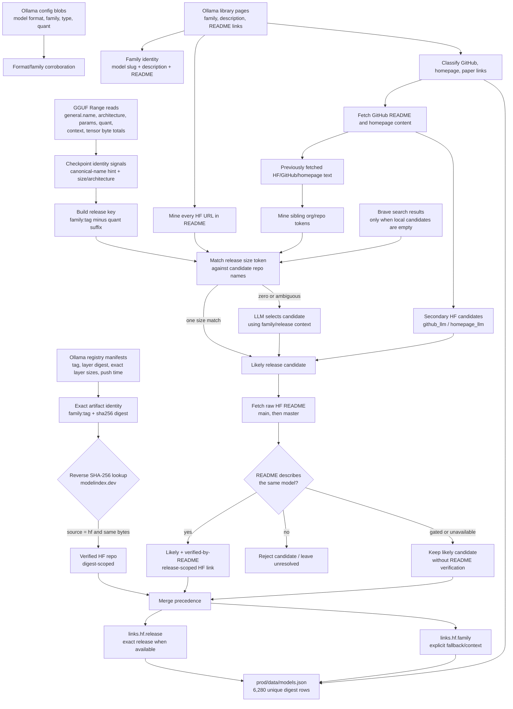

# Model identification and Hugging Face linking

This is the evidence flow represented by the currently fetched data. Counts are from the
production snapshot generated on **2026-09-09**.

## What was fetched and how it identifies a model

| Fetched evidence | Durable location | Identification value |
|---|---|---|
| Ollama family page and README | `data/out/library.json` | Family slug, description, upstream URLs, and textual model/release context |
| Registry manifest and config | `data/out/models.jsonl` | Exact tag, raw GGUF SHA-256 digest, byte sizes, format, family, type, and quantization |
| GGUF header via HTTP Range | `data/out/models.jsonl` | `general.name`, architecture, parameter count, context, quantization, and tensor sizes without downloading the full model |
| Reverse-hash responses | `data/cache/identity/imported/hash_lookup/` | Byte-identical HF upload; strongest evidence because the Ollama layer and HF file share a digest |
| HF candidates and decisions | `data/out/identity_v2.json` | Artifact- and release-scoped repo selections, method, confidence, and unresolved sets |
| Brave search audit | `data/identity/evidence/search_audits/brave_search_results.json` | Last-resort HF candidates for families with no README/content candidates |
| GitHub/homepage/paper decisions | `data/out/links.json` | Project-level provenance and secondary routes to an HF repo |
| Saved HF/GitHub/homepage content | `data/identity/evidence/link_content/<family>.json` | Model-card/README text used to verify identity and discover sibling checkpoints |
| Final joined catalog | `prod/data/models.json` | One record per unique digest with `release` and resolved provenance links |

## Current HF-linking coverage

| Measure | Count |
|---|---:|
| Unique production model artifacts | 6,280 |
| Digest lookups attempted | 6,280 |
| Byte-identical, digest-verified HF matches | 240 |
| Likely family mappings | 177 |
| Likely release mappings | 380 |
| Production rows with a release-specific HF link | 2,676 |
| Production rows using only the explicit family fallback | 1,974 |
| Production rows without an HF link | 1,630 |
| Distinct HF repos linked from production rows | 351 |
| Saved family content bundles | 194 |
| Unresolved families / releases in the HF audit | 11 / 549 |

The key safety rule is that an HF link is **release-scoped**. For example, different sizes in
one Ollama family may originate from different Hugging Face repositories. Consumers should use
`links.hf.release` first and only fall back to `links.hf.family`, visibly treating that fallback
as not size-confirmed.

## Example final link

For `alfred:40b-1023-q4_1`, the quant suffix is removed to form release
`alfred:40b-1023`. Its release-specific result is
[lightonai/alfred-40b-1023](https://huggingface.co/lightonai/alfred-40b-1023), with
`confidence: likely` and `method: readme_verified`.

Related implementation: [`scripts/crawl.py`](../scripts/crawl.py), the
[`identity/`](../identity/) package, and
[`scripts/build_prod_data.py`](../scripts/build_prod_data.py). Retired resolver code is retained
only in the gitignored `legacy/` workspace tree.
