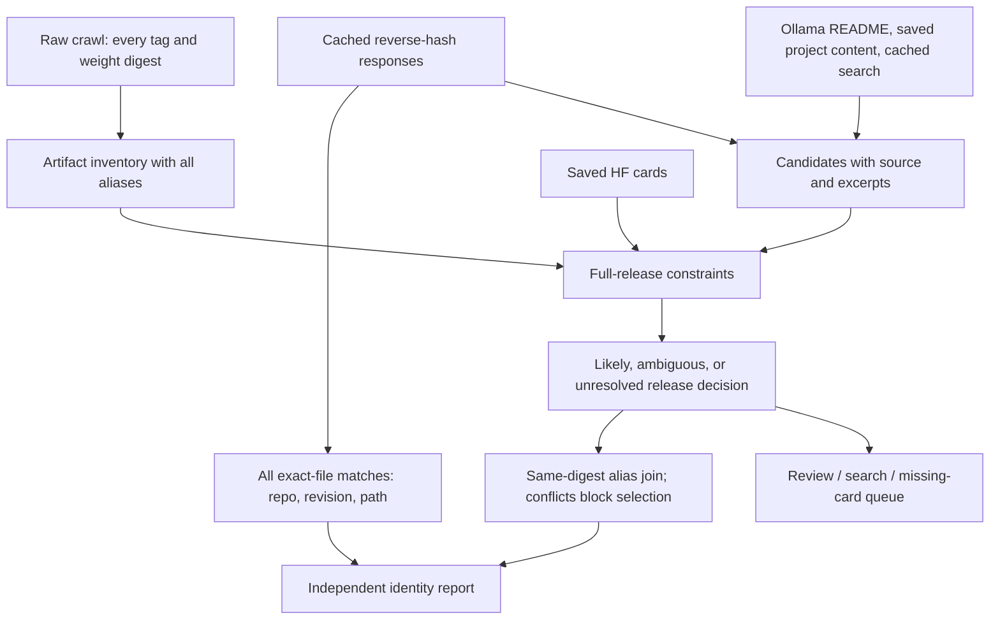

# Model identity resolver: independent rebuild

Status: resolver 1.3.0, with alias constraints, digest-aligned comparison, bounded public
model-card/search enrichment, semantic verification, opt-in production build integration,
and UI support for the new confidence semantics.
Implementation: `identity/`. Tests: `tests/identity_tests/`.
Session log: [model-identity-handoff.md](model-identity-handoff.md).

## Objective and scope

Reconstruct artifact and release identities from the data already fetched. Preserve all aliases,
keep byte-identical HF uploads separate from likely upstream repositories, and emit reproducible
decisions with evidence. This module is independent of `hf_source.py`, `links.py`, and
`link_common.py`; it uses only Python's standard library.

The resolver command remains an offline rebuild. The separate `identity.fetch` command
adapter is plan-only by default; `--fetch` enables bounded public HTTP reads. Neither command
spends API credits, makes LLM calls, mutates legacy caches, or updates the production catalog.
Production cutover is a separate step.

## Data flow



## Input contract

All paths below are relative to `--data-dir`; there are no reads from `prod/`.

| Input | Requirement | Use |
|---|---|---|
| `out/models.jsonl` | Required | Inventory from `weight_digest` (or `digest`), model/tag/ref, aliases, names, architectures |
| `out/library.json` | Optional | Family README candidate discovery |
| `link_content/<family>.json` | Optional | HF cards, GitHub README, homepage text and sibling links |
| `cache/hf_readme/*.json` | Optional | Existing raw model-card text |
| `cache/identity/imported/hash_lookup/<hex>.json` | Optional | Imported `source=hf` exact-file hits |
| `hf_links/brave_search_results.json` | Optional | Previously fetched search candidates |
| `cache/identity/hf_cards/*.json` | Optional | Independently fetched cards with checksums and retry states |

Missing optional files supply no evidence. Malformed JSON fails explicitly. Rows without a
valid SHA-256 weight digest are excluded from the artifact inventory. The report records the
raw row count and inventory counts, but does not yet provide a per-invalid-row rejection log.
Existing legacy picks and LLM verification decisions are deliberately not imported as truth.
When both durable HF content and a README cache entry exist, durable family content wins;
the selected card text is included by hash in decision identity.
An independently fetched, integrity-checked document takes precedence over legacy content.
Failed refreshes preserve the last-good document. Retry status and document age are retained
in its cache entry; a stale retained document remains usable evidence, not a fresh fetch.

## Identity and matching rules

1. A weight digest identifies an artifact. Preserve all refs and release keys pointing at it.
   This identity is specific to weights, not an entire Ollama package: projector/config digests
   can differ and are not used to claim package equivalence.
2. A release key removes only a recognized trailing quantization suffix. Quant-only aliases
   become `family:default`; sizes, dates, base-model qualifiers, and modes remain intact.
3. Generic aliases (`latest`, `default`) cannot independently select a release. They can benefit
   from a successful explicit alias on the same digest in the artifact result.
4. Size tokens compare exactly, including decimals, M/B units and MoE notation. `7b` does not
   equal `27b` or `8x7b`. No approximate parameter-count conversion is attempted.
5. Explicit base/instruct/chat/thinking modes and remaining release qualifiers must match.
   Missing mode does not mean base: if the candidate set contains a named variant, an unspecified
   release stays unresolved when that variant is otherwise compatible with the target's family,
   size and qualifiers. An unrelated 13B instruct candidate no longer blocks a 7B base candidate.
6. The normalized family name must appear in the candidate repository name. Publisher renames
   and family aliases need future explicit evidence; they are not guessed.
7. Repositories explicitly labeled GGUF/GPTQ/AWQ/EXL2 are retained as evidence but cannot win
   upstream selection through this heuristic. Exact-file hits remain available independently.
8. A saved, nonempty model card is required for a likely pick. Card availability is **not semantic
   verification**. The method is `release_name_constraints`, never `readme_verified`.
9. Exactly one surviving repo with a card yields `likely` only if no other name-compatible
   candidate awaits its card. Missing cards are not negative identity evidence. Several viable
   or card-pending candidates yield `ambiguous`; a lone card-pending candidate stays unresolved.
   Hash matches do not suppress release resolution for other quantizations.
10. Combine alias constraints within each (digest, family) **before** making artifact decisions.
    Generic aliases inherit explicit constraints only within their own digest. They never change
    the constraints of another quantization. Conflicting sizes/modes block an artifact pick.
11. A token such as `1m` becomes a context qualifier only when a same-digest explicit alias contains
    both that token and a B-sized model (for example `7b-chat-1m`). An isolated `137m` remains a
    parameter-size token. This is an evidence-conditioned convention, not general NLP parsing.
12. Normalize `16x17b` to `17b` plus `16e` only when an explicit same-digest alias supplies both
    fields and the GGUF expert count corroborates 16. Never multiply this notation to infer total
    parameters. Without corroboration, differing size notations remain a conflict.
13. Multiple family decisions on the same digest must agree on the upstream repo or the artifact
    remains in conflict. Raw per-release decisions remain separate from alias-constrained artifact
    decisions, so generic releases can remain unresolved while their artifacts have likely picks.

Candidate discovery uses strict URL host parsing for HF URLs and family-filtered bare repo
tokens. Every candidate retains source, kind, and a local text excerpt. Mentions may describe
ancestors or comparison models; they are discovery evidence, not proof of identity.

## Output contract

`schema_version: 2` describes this new report, not the legacy production schema.

- `resolver_version`: implementation version used in decision fingerprints.
- `input_sha256`: checksum of the raw crawl input.
- `input_files` and `evidence_snapshot_sha256`: checksums of all consumed files, including null
  markers for absent optional files. Each file is parsed from the same bytes used for its checksum.
  These identify the consumed evidence; they do not assert that all original fetches occurred together.
- `summary`: row, artifact, release, exact-hit, decision-status, and queue counts.
- `by_release`: status, nullable repo/method, per-candidate rejection reasons, evidence,
  decision fingerprint, supporting digests and refs.
- `by_digest`: refs, releases, names, architectures, all exact `file_matches`, and an independent
  `upstream` result including supporting releases and conflict information. Parameter/expert counts
  are preserved. `family_decisions` references detailed decisions by `decision_key`.
- `artifact_decisions`: deduplicated detailed alias-constrained decisions, including normalization
  notes, input tags, constraints, candidate reasons and evidence. The key includes those constraints.
- `enrichment_queue`: unresolved/ambiguous releases. `fetch_cards` lists candidates whose only
  missing requirement is card availability; `review_or_search` requests broader investigation.
- `artifact_enrichment_queue`: actionable groups of unresolved artifacts sharing a constraint
  decision. Already resolved artifacts are excluded; contradictions become `review_conflict`
  and cannot trigger fetches. The fetch adapter uses this queue, not the older release queue.

Exact-file matches retain `repo`, `commit_sha`, and `path`, labeled `byte_verified`. The
confidence applies to the cached reverse-hash match; it does not certify publisher authority.
Do not arbitrarily pick a shortest repo name from multiple identical uploads.

Decision fingerprints cover full release, resolver version, candidate evidence, and card text
hashes. Decisions are recomputed offline on every invocation, so stale legacy decision caches
cannot override new evidence. Fetch-cache freshness remains a future adapter responsibility.
Output ordering is stable and output replacement is atomic on the destination filesystem.

## Run and validation

```powershell
python -m unittest discover -s tests
python -m identity resolver --data-dir data --out data/out/identity_v2.json
python -m identity compare --identity data/out/identity_v2.json --legacy prod/data/models.json --out data/out/identity_v2_comparison.json
```

## Public model-card enrichment

```powershell
# Plan only: no HTTP requests or cache writes.
python -m identity fetch --identity data/out/identity_v2.json --data-dir data --out data/out/identity_v2_fetch_plan.json
# Bounded execution, then rebuild and compare using the commands above.
python -m identity fetch --identity data/out/identity_v2.json --data-dir data --out data/out/identity_v2_fetch_run.json --fetch --max-repos 3 --max-requests 6 --max-seconds 35 --timeout 8
```

The plan deduplicates repositories and prioritizes the number of unresolved artifacts affected.
Only name-compatible missing-card candidates are fetched. Default budgets are ten repositories,
twenty HTTP requests and sixty seconds, with a ten-second per-operation socket timeout. Time is
checked between requests; this is not a hard process deadline for a server trickling a body.
Every explicit redirect consumes the HTTP budget. Requests stay on HTTPS `huggingface.co`; no
authentication is loaded or forwarded. Bodies are capped at 400,000 bytes; HTML shells, empty
bodies and oversized responses are not accepted as cards.

Fetch `main/README.md` first; try `master` only after a 404. If budget runs out during fallback
or redirect, persist the pending location so the next run can resume. The adapter validates repo
paths and redirect hosts, refuses output/evidence collisions, and atomically writes its own cache.

| State | Retry policy |
|---|---|
| `ok` | 30 days |
| `not_found` (both branches 404) | 7 days |
| `denied` (401/403) | 1 day; no authentication bypass |
| `empty`, `invalid_content`, `too_large`, `redirect_error`, other HTTP errors | 1 day |
| `transient_error` (transport, 408, 5xx) | 5 minutes |
| `rate_limited` (429) | Honor Retry-After (seconds or date), minimum 60 seconds; default 5 minutes |
| `deferred` (budget exhausted) | Resume on a later invocation |

Rate limits persist in `cache/identity/rate_limit.json` and stop further requests across
repositories and invocations. `--retry-transient` permits a retry after connectivity is repaired;
it bypasses only transient transport/server backoff, never rate limits or denied access.
There are no in-process sleep/retry loops. Cache entries retain attempt timestamps, status codes,
branch/URL, last state, next retry time and the last-good document with content SHA-256 and
the returned `x-repo-commit` revision when available. Absence of that header does not invent a revision.

Successful cards are consumed by the next offline rebuild. They do not themselves establish
semantic identity or publisher authority. Fetching does not run search, discover new sibling
repos from newly fetched cards, or alter release constraints.

## Targeted search and semantic verification

`identity.search` searches only unresolved artifact groups whose local candidates
do not survive structural constraints. Queries contain the family and explicit size, mode, and
release qualifiers. Results are strictly parsed as HF repositories, deduplicated, cached under
`cache/identity/search/`, and consumed as candidates on the next offline rebuild. Ambiguous
groups are left for review rather than widened with more search results.

`identity.verify` evaluates likely artifact decisions using the selected model
card, exact alias constraints, and source excerpts. Its prompt distinguishes an exact release
from relatives, base models, descendants, conversions, mirrors, benchmarks, and comparisons.
The closed verdict vocabulary is `yes`, `no`, or `uncertain` for both exact release and upstream
status. A nonempty evidence quote must be found in the supplied card; whitespace-only formatting
differences are grounded back to the exact source substring. Invalid replies are discarded.

Verdicts are cached by decision key plus card SHA-256, prompt version, and LLM model. A `yes/yes`
verdict changes the method to `semantic_verified`. A `no` for either claim rejects that artifact
decision. An uncertain verdict remains visible without upgrading confidence. Semantic decisions
never promote exact-file confidence to another quantization.

```powershell
python -m identity search --identity data/out/identity_v2.json --data-dir data --out data/out/identity_v2_search.json --execute --limit 5
python -m identity verify --identity data/out/identity_v2.json --data-dir data --out data/out/identity_v2_verify.json --execute --limit 20
```

These commands use `BRAVE_SEARCH_API_KEY` and `OPENROUTER_API_KEY` / `OPENROUTER_BASE_URL`
respectively. Calls are explicit and bounded by `--limit`; successful results remain auditable.
The semantic verifier currently runs sequentially with a 50-second per-call timeout and does not
retry within a run.

## Production preview adapter

`identity.export` attaches an `identity_v2` envelope to a copy of the production
catalog while leaving legacy `links` unchanged. By default it exports upstream repos only from
`semantic_verified` artifact decisions. Exact-file uploads are included independently. The
explicit `--include-provisional` flag includes name-constraint decisions labeled `provisional`.
Input reports are hashed, duplicate production digests fail, and the output cannot overwrite an
input file.

```powershell
python -m identity export --identity data/out/identity_v2.json --models prod/data/models.json --out data/out/models_identity_preview.json
```

The production builder exposes the same behavior behind an opt-in flag:

```powershell
python scripts/build_prod_data.py --identity data/out/identity_v2.json --out-dir data/out/prod_identity_preview
```

Without `--identity`, the builder follows its existing path and schema. With the flag, it adds
the envelope to model rows and records resolver version, evidence snapshot, inclusion policy,
and counts in `manifest.json`. `--identity-include-provisional` is available for explicit review
builds; the default includes only semantic-verified upstream links. The web client prefers an
identity-v2 upstream when present, marks semantic verification as verified, explains provisional
confidence distinctly, and falls back to the legacy release/family link when the envelope has no
upstream. Exact uploads stay in the data envelope and are not presented as publisher links.

Regression contracts cover substring sizes, MoE, version/mode mismatch, generic aliases,
unavailable cards, converted repositories, URL host spoofing, retained aliases, candidate
ambiguity, evidence fingerprint changes, deterministic offline replay, same-digest propagation,
multiple hash uploads, preserved revisions, no byte-verification propagation across quants,
and alias conflicts. The reviewed fixture at `tests/identity_tests/fixtures/model_identity_review.json` covers
four real alias cases and twelve selection cases (including nine competing legacy picks).
It records agent review of saved evidence, not independent human ground truth.

The comparison module aligns only shared digests and lists additions/removals separately. It
compares legacy **likely release** links with new likely upstream picks. Legacy byte-verified
uploads and family fallbacks are recorded separately because their semantics differ. Both input
reports are hashed. Comparison categories are agreement, disagreement, new-only, legacy-only,
or neither; none is an accuracy label. It refuses duplicate legacy digests and output paths that
overwrite its inputs. Resolver output likewise cannot overwrite a consumed evidence input.

Acceptance for this offline implementation: tests pass, raw inventory is used without requiring
production files, report generation succeeds against fetched data, and no legacy output changes.
Acceptance for production integration: a human-reviewed fixture set demonstrates release-level
precision; review every newly selected or conflicting mapping in a pilot. Coverage alone is
not an accuracy measure, and `likely` cannot be presented as verified.

## Planned extensions, in order

1. Expand the implemented agent-reviewed fixtures into an independently reviewed evaluation set
   including renamed repositories, ancestor mentions and uncertain defaults. The current
   digest-aligned comparison captures input hashes but is not a same-fetch-date accuracy benchmark.
2. Extend the implemented alias constraints with evidence-backed version and family normalization.
   Do not globally assume chat equals instruct or generic size equals base.
3. Extend semantic verification with structured HF metadata and targeted card sections. Evaluate
   rejected and uncertain verdicts independently before using them for catalog removal.
4. Continue bounded card/search enrichment, excluding candidates rejected against unchanged
   evidence. Add sibling discovery only with source-role classification.
5. Independently review a representative sample of semantic verdicts and new-only mappings.
6. After independent review, enable the implemented production flag in the release build and
   decide how exact-upload evidence should appear in detailed UI. Preserve artifact-upload and
   upstream fields as distinct concepts.

No manual adjudication registry, independent precision benchmark, default-on release integration,
or exact-upload UI panel is implemented in this version.
